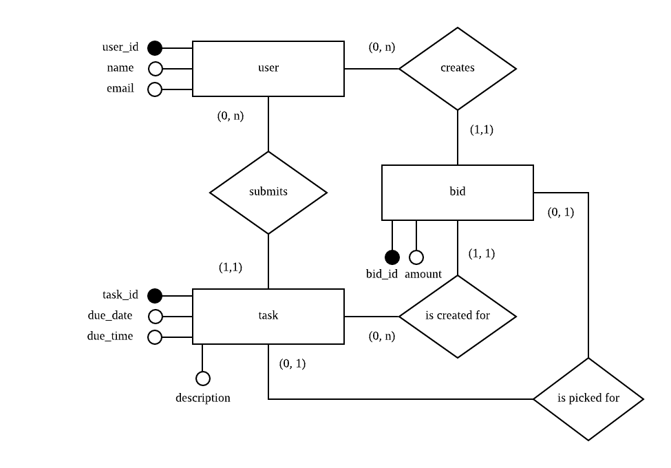

## Design Report(team 37)

* Entity Relationship Diagram


* SQL DDL Code
```sql
CREATE TABLE user (
user_id INTEGER PRIMARY KEY,
name VARCHAR(64) NOT NULL,
email VARCHAR(64)) NOT NULL;

CREATE TABLE task (
task_id INTEGER PRIMARY KEY,
owner_id INTEGER NOT NULL,
due_date DATE NOT NULL,
dut_time TIME NOT NULL,
description VARCHAR(256) NOT NULL,
FOREIGN KEY owner_id REFERENCES user(user_id) ON DELETE CASCADE);

CREATE TABLE bid (
bid_id INTEGER PRIMARY KEY,
bidder_id INTEGER NOT NULL,
task_id INTEGER NOT NULL,
amount NUMERIC NOT NULL,
FOREIGN KEY bidder_id REFERENCES user(user_id) ON DELETE CASCADE,
FOREIGN KEY task_id REFERENCES task(task_id) ON DELETE CASCADE);

CREATE TABLE is_picked_for (
task_id INTEGER PRIMARY KEY,
bid_id NUMERIC NOT NULL,
FOREIGN KEY task_id REFERENCES task(task_id) ON DELETE CASCADE,
FOREIGN KEY bid_id REFERENCES bid(bid_id) ON DELETE CASCADE);
```
